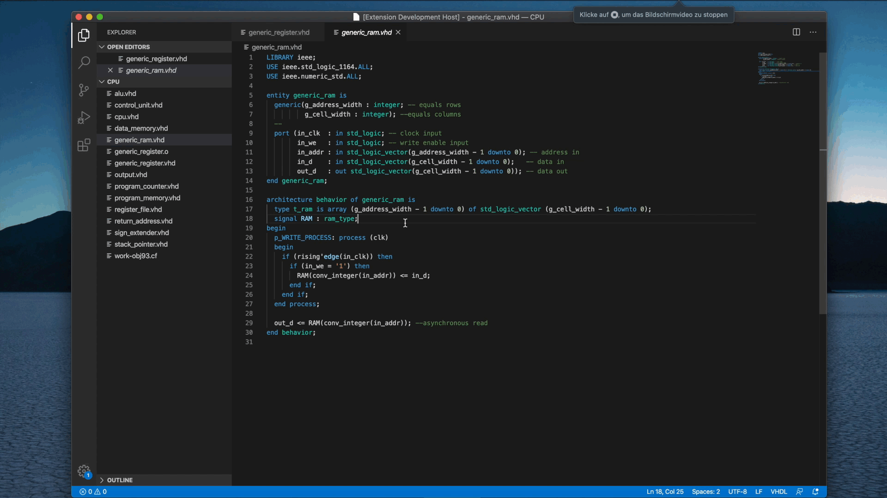

<h1 align="center"> GHDL Interface </h1>
This extension allows you to invoke GHDL functions, as well as GTKWave. Beyond it highlights the errors that were reported by GHDL in the editor. 

## Requirements 
You will need to have [GHDL](https://github.com/ghdl/ghdl/releases) and [GTKWave](http://gtkwave.sourceforge.net/) installed on your system. Furthermore both must be set in your environment variables. 

## Usage 
**GHDL**
At present it is possible to invoke the following GHDL functions by either rightclicking at the editor or at the explorer on the specific file and then selecting the desired funtion. 

| Editor Option  | GHDL Function                  |
| -------------- | :----------------------------- |
| ghdl analyze   | `ghdl -a [File]`               |
| ghdl elaborate | `ghdl -e [Unit]`               |
| ghdl run       | `ghdl -r [Unit] [export file]` |
| ghdl clear     | `ghdl -c`                      |
| ghdl remove    | `ghdl -r`                      |

In addition the GHDL analyze function offers you error highlighting in the editor. 
**GTKWave:** To open your simulation files with GTKWave, simply rightclick on them (.ghw or .vcd file required) in the explorer and then select `gtkwave` 
## Keybindings 
It is also possible to invoke the GHDL functions via the following keybindings.

| Editor Option  | Windows          | Linux             | MacOS             |
| -------------- | :--------------- | :---------------- | :---------------- |
| ghdl analyze   | `ctrl + alt + a` | `shift + alt + a` | `shift + cmd + a` |
| ghdl elaborate | `ctrl + alt + l` | `shift + alt + e` | `shift + cmd + e` |
| ghdl run       | `ctrl + alt + r` | `shift + alt + r` | `shift + cmd + r` |
| ghdl clear     | `ctrl + alt + c` | `shift + alt + c` | `shift + cmd + c` |
| ghdl remove    | `ctrl + alt + d` | `shift + alt + d` | `shift + cmd + d` |

## Contributions
In case you encounter any problems or have suggestions regarding the extension, feel free to open an issue at first.
## License
The extension is [licensed](LICENSE "license") under the MIT license.

